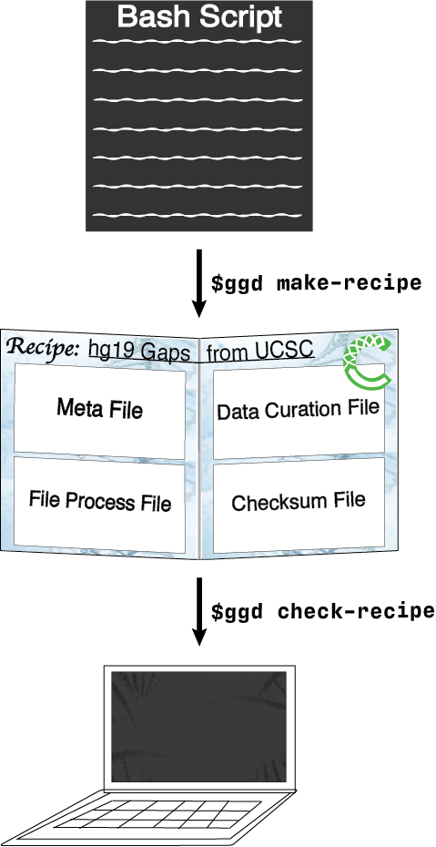
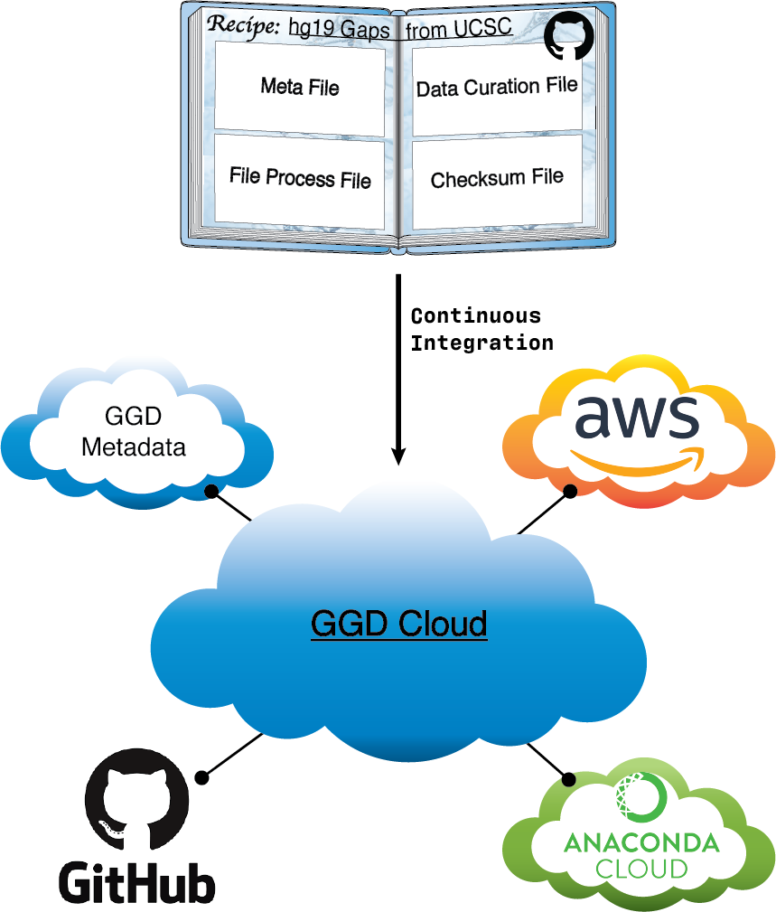
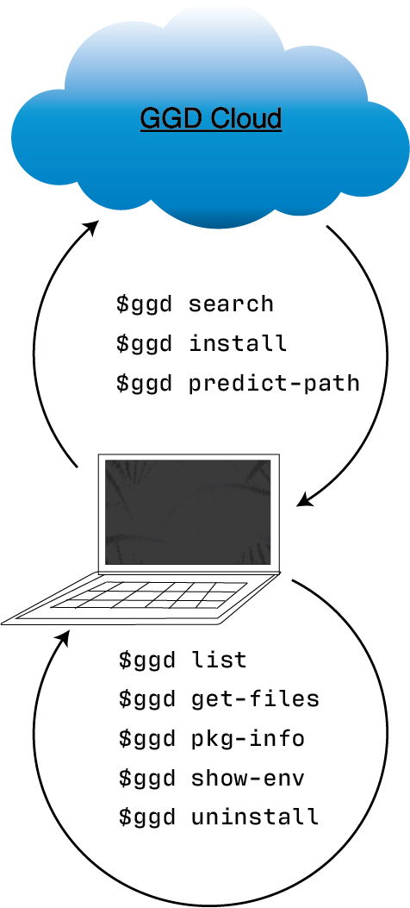

.. ggd documentation master file, created by
   sphinx-quickstart on Wed Dec 19 10:28:31 2018.
   You can adapt this file completely to your liking, but it should at least
   contain the root `toctree` directive.

.. _home-page:

**To see and/or search for data packages available through GGD, see:** :ref:`Available data packages <recipes>`

**For a quick-start guide to using ggd see:** :ref:`GGD Quick Start <quick-start>`

**To request a new data recipe please fill out the** `GGD Recipe Request <https://forms.gle/3WEWgGGeh7ohAjcJA>`_ **Form.** 

**For details on creating and adding recipes to ggd see the** :ref:`Contribute <make-data-packages>` **page.**

Go Get Data (ggd) is a data management system that provides access to data packages containing auto curated genomic data.
ggd data packages contain all necessary information for data extraction, handling, and processing. With a  growing number 
of scientific datasets, ggd provides access to these datasets without the hassle of finding, downloading, and processing them
yourself. ggd leverages the `conda <http://conda.pydata.org/docs/intro.html>`_ package management system
and the infrastructure of `Bioconda <https://bioconda.github.io/index.html>`_ to provide a fast and easy way to
retrieve processed annotations and datasets, supporting data provenance, and providing a stable source of reproducibility. 
Using the ggd data management system allows any user to quickly access all desired datasets, manage that data within an environment, 
and provides a platform upon which to cite data access and use by way of the ggd data package name and version.

.. image:: ggd-Figure1.png

Go Get Data acts as a multi use tool for genomic data access and management. It provide a system for simple data access all the way to a
complete data management including version tracking, dependency handling, data format standards, and more. Whether using ggd for data 
access in genomic workflows, for an analysis, or for any other reason, ggd has been developed to work in many situations. 

We want to briefly highlight ggd's ability to work with multiple conda environments at the same time. Multiple tools in ggd use a 
:code:`--prefix` flag. This prefix flag allows a user to install, manage, and access data in a specific conda environment. Therefore, 
a scientist could install ggd data packages into a conda environment set apart for data storage, as well as access and use that data, all 
without being in that environment. This helps to reduce the common multiple occurrences of the same dataset or annotation installed 
on your system. It also improves the flexibility one has with using the data on different platforms, in different environments, and with 
different software tools. 

ggd consists of:
++++++++++++++++

- a `repository of data recipes <https://github.com/gogetdata/ggd-recipes>`_ hosted on Github
- a `command line interface (cli) <https://github.com/gogetdata/ggd-cli>`_ to communicate with the ggd ecosystem
- a continually growing list of genomic recipes to provide quick and easy access to processed genomic data
  using the ggd cli tool

Capabilities
++++++++++++

See :ref:`GGD Quick Start <quick-start>` to start using ggd with minimal information. 

Use :code:`ggd` to search, find, and install a data package hosted by ggd. The data package will be installed and processed
on your system, and give you ready-to-use data files. For additional information see :ref:`Using GGD<using-ggd>`.

How 'Go Get Data' works:
++++++++++++++++++++++++

ggd is built upon principles for data access, usability, provenance, and management on a local environment. Basic principles 
include:

1) Data recipe creation
2) Data package infrastructure
3) Data access and management

Data recipe creation
--------------------

Data recipes are the core of ggd. They represent the standardization and reproducible access to genomic datasets and 
annotations. Whether the recipe is simple or complex, they make up the infrastructure of ggd and the support for simple
access to data recipes. Therefore, recipe creation is a vital part of ggd. 

Although the ggd team is working to add additional data recipes to the ggd ecosystem, we intend for ggd to be a community 
driven project. As such, ggd relies on community contributions. Therefore, ggd has simplified the process of creating data
recipes and contributing them to ggd. One simply needs to combine the different steps required to access and process a 
desired data set into a bash script. Once the bash script has been created they can run :code:`ggd make-recipe` to create 
a ggd data recipe. 

A data recipe consists of a meta data file, a data curation script, a local file and environment handling script, and 
a checksum file. Together, these files represent the necessary instructions ggd will use to install and manage a data 
recipe on your local system. 

Validation of the new recipe is a required part of the contribution process. After creating a recipe, simply run 
:code:`ggd check-recipe` to validate the recipe is working correctly. 

For further details about contributing data recipes to ggd see :ref:`Contribute <make-data-packages>`.

Data package infrastructure
---------------------------

Another vital part of ggd is the infrastructure used to provide access to available data recipes. ggd has integrated multiple 
ecosystems together in order to control such access. 

First, recipes are compiled together as "cookbooks" on github. This github repo acts as the first stage of recipe access.

Second, a continuous integration (CI) system provides automatic data recipe validation. This CI system acts as a the second stage
to ensure that each data recipe works correctly. 

Third, the CI system packages the recipe into a data packages. These data packages contain the same information as the recipe, but 
are easier to manage and transfer. 

Fourth, we utilize the ecosystem of the Anaconda cloud to store data package(s). Once a recipe has been validated and a packaged the package 
is pushed to the Anaconda cloud. 

Fifth, we also utilize the ecosystem of Amazon cloud storage. Processed package contents are stored on Amazon cloud storage to improve speed 
and accuracy of data curation. 

Sixth, the CI system automatically maintains local and global levels of ggd metadata. This metadata is a crucial part of the ggd ecosystem. Automatic 
maintenance provides a stable and structured way to ensure metadata is maintained and properly accounted for. 

Data access and management
--------------------------

Finally, and most importantly, is the ability to access and manage the data on your local system. This is the main purpose of the command line interface (CLI)
for ggd. Simply, ggd CLI provides tools for installing data packages on your local system, but more importantly, tools for access and use on your system. For 
more information about the CLI tools see :ref:`GGD CLI <ggd_cli_page>`.

========

Example:
++++++++

1. Let's say you you need to align some sequence(s) to the human reference genome for an analysis you are doing. 
   You will need to download the reference genome from one of the sites that hosts it. You will need to make sure it is 
   the correct genome build, it is the right reference genome, and download it from the site. You will then need 
   to sort and index the reference genome before you can use it. GGD simplifies this process by allowing you to search
   and install available processed genomic data packages using the ggd tool. 

.. note::

   The example below is not necessarily the 
   correct data package for your needs, but rather is an example of using ggd

.. code-block:: bash

    #******************************
    #1. Search for a reference genome
    #   (See ggd search)
    #******************************

    $ ggd search grch37 reference-genome 

    ----------------------------------------------------------------------------------------------------

      grch37-reference-genome-ensembl-v1
      ==================================

	  Summary: The GRCh37 unmasked genomic DNA sequence reference genome from Ensembl-Release 75. Includes all sequence regions EXCLUDING haplotypes and patches. 'Primary Assembly file'

      Species: Homo_sapiens

      Genome Build: GRCh37

      Keywords: Primary-Assembly, Release-75, ref, reference, Ensembl-ref, DNA-Sequence, Fasta-Sequence, fasta-file

      Data Provider: Ensembl

      Data Version: release-75_2-3-14

      File type(s): fa

      Data file coordinate base: NA

      Included Data Files:
          grch37-reference-genome-ensembl-v1.fa
          grch37-reference-genome-ensembl-v1.fa.fai

      Approximate Data File Sizes:
          grch37-reference-genome-ensembl-v1.fa: 3.15G
          grch37-reference-genome-ensembl-v1.fa.fai: 2.74K

      To install run:
          ggd install grch37-reference-genome-ensembl-v1

    ----------------------------------------------------------------------------------------------------

      grch37-reference-genome-gencode-v1
      ==================================

      Summary: The GRCh37 DNA nucleotide sequence primary assembly. Sequence regions include reference chromosomes and scaffoldings.

      Species: Homo_sapiens

      Genome Build: GRCh37

      Keywords: Reference-Genome, Fasta, DNA-Sequence, GENCODE-34, Fasta-sequence, primary-assembly

      Data Provider: GENCODE

      Data Version: release-34

      File type(s): fa

      Data file coordinate base: NA

      Included Data Files:
          grch37-reference-genome-gencode-v1.fa.gz
          grch37-reference-genome-gencode-v1.fa.gz.fai
          grch37-reference-genome-gencode-v1.fa.gz.gzi

      Approximate Data File Sizes:
          grch37-reference-genome-gencode-v1.fa.gz: 881.99M
          grch37-reference-genome-gencode-v1.fa.gz.fai: 2.74K
          grch37-reference-genome-gencode-v1.fa.gz.gzi: 772.92K

      To install run:
          ggd install grch37-reference-genome-gencode-v1

    ----------------------------------------------------------------------------------------------------

      grch37-toplevel-reference-genome-ensembl-v1
      ===========================================

      Summary: The GRCh37 unmasked genomic DNA sequence reference genome from Ensembl-Release 75. Includes all sequence regions flagged as toplevel by Ensembl including chromosomes, regions not assembled into chromosomes, and N padded haplotype/patch regions. 'Top Level file'

      Species: Homo_sapiens

      Genome Build: GRCh37

      Keywords: Top-Level, Release-75, ref, reference, Ensembl-ref, DNA-Sequence, Fasta-Sequence, fasta-file

      Data Provider: Ensembl

      Data Version: release-75_2-3-14

      File type(s): fa

      Data file coordinate base: NA

      Included Data Files:
          grch37-toplevel-reference-genome-ensembl-v1.fa.gz
          grch37-toplevel-reference-genome-ensembl-v1.fa.gz.fai
          grch37-toplevel-reference-genome-ensembl-v1.fa.gz.gzi

      Approximate Data File Sizes:
          grch37-toplevel-reference-genome-ensembl-v1.fa.gz: 1.09G
          grch37-toplevel-reference-genome-ensembl-v1.fa.gz.fai: 11.65K
          grch37-toplevel-reference-genome-ensembl-v1.fa.gz.gzi: 7.98M

      To install run:
          ggd install grch37-toplevel-reference-genome-ensembl-v1

    ----------------------------------------------------------------------------------------------------

    .
    .
    .

    #******************************
    #2. Install the grch37 reference genome from Ensembl
    #   (See ggd install)
    #******************************

    $ ggd install grch37-reference-genome-ensembl-v1

      :ggd:install: Looking for grch37-reference-genome-ensembl-v1 in the 'ggd-genomics' channel

      :ggd:install: grch37-reference-genome-ensembl-v1 exists in the ggd-genomics channel

      :ggd:install: grch37-reference-genome-ensembl-v1 version 1 is not installed on your system

      :ggd:install: grch37-reference-genome-ensembl-v1 has not been installed by conda

      :ggd:install: The grch37-reference-genome-ensembl-v1 package is uploaded to an aws S3 bucket. To reduce processing time the package will be downloaded from an aws S3 bucket

      :ggd:install:   Attempting to install the following cached package(s):
        grch37-reference-genome-ensembl-v1

      :ggd:utils:bypass: Installing grch37-reference-genome-ensembl-v1 from the ggd-genomics conda channel

      Collecting package metadata: done
      Processing data: done

      ## Package Plan ##

        environment location: <env>

        added / updated specs:
          - grch37-reference-genome-ensembl-v1

      The following packages will be downloaded:

          package                    |                        build
          ---------------------------|--------------------------------
          grch37-reference-genome-ensembl-v1-1|                1           6 KB  ggd-genomics
          ------------------------------------------------------------
                                                 Total:           6 KB

      The following NEW packages will be INSTALLED:

        grch37-reference-~ ggd-genomics/noarch::grch37-reference-genome-ensembl-v1-1-1

      Downloading and Extracting Packages
      grch37-reference-gen | 6 KB      | ############################################################################ | 100% 
      Preparing transaction: done
      Verifying transaction: done
      Executing transaction: done

      :ggd:install: Updating installed package list

      :ggd:install: Initiating data file content validation using checksum

      :ggd:install: Checksum for grch37-reference-genome-ensembl-v1

      :ggd:install: ** Successful Checksum **

      :ggd:install: Install Complete

      :ggd:install: Installed file locations
      ======================================================================================================================

               GGD Package                                     Environment Variable(s)                                    
           ----------------------------------------------------------------------------------------------------
      -> grch37-reference-genome-ensembl-v1               $ggd_grch37_reference_genome-ensembl_v1_dir                        
                                                          $ggd_grch37_reference_genome_ensembl_v1_file                           

      Install Path: <conda root>/share/ggd/Homo_sapiens/GRCh37/grch37-reference-genome-ensembl-v1/1

      :ggd:install: To activate environment variables run `source activate base` in the environment the packages were installed in

      :ggd:install: NOTE: These environment variables are specific to the <env> conda environment and can only be accessed from within that environment
      ======================================================================================================================

      :ggd:install: Environment Variables
      *****************************

      Inactive or out-of-date environment variables:
      > $ggd_grch37_reference_genome-ensembl_v1_dir
      > $ggd_grch37_reference_genome_ensembl_v1_file 

      To activate inactive or out-of-date vars, run:
      source activate base

      *****************************

      :ggd:install: DONE 

    #******************************
    #3. Identify the data environment variable or the file location 
    #   (See ggd list, ggd show-env, or ggd get-files)
    #******************************

    $ ggd list

      # Packages in environment: <env>
      #
      ------------------------------------------------------------------------------------------------------------------------
          Name                                Pkg-Version Pkg-Build   Channel         Environment-Variables
      ------------------------------------------------------------------------------------------------------------------------
      -> grch37-reference-genome-ensembl-v1     1         1         ggd-genomics     $ggd_grch37_reference_genome-ensembl_v1_dir, $ggd_grch37_reference_genome_ensembl_v1_file 

      # To use the environment variables run `source activate base`
      # You can see the available ggd data package environment variables by running `ggd show-env`

    $ ggd show-env

        ***************************
        Active environment variables:
        > $ggd_grch38_reference_genome-ensembl_v1_dir
        > $ggd_grch38_reference_genome-ensembl_v1_file
        ***************************

    $ ggd get-files grch38-reference-genome-ensembl-v1

      <conda root>/share/ggd/Homo_sapiens/GRCh38/grch38-reference-genome-ensembl-ensembl-v1/1/grch38-reference-genome-ensembl-v1.fa
      <conda root>/share/ggd/Homo_sapiens/GRCh38/grch38-reference-genome-ensembl-ensembl-v1/1/grch38-reference-genome-ensembl-v1.fa.fai

    #******************************
    #4. Use files  
    #    To use the downloaded data packages you can use the full file path from running `ggd get-files` 
    #    or the environment variables created during installation
    #   For more info see the `Using installed data` tab.
    #******************************

.. When using ggd please **cite our article** `author list <>`_.

Available Data Packages
-----------------------
You can see and search for available packages using the :ref:`Available packages <recipes>` page of the
ggd documentation

If you have the ggd cli tool installed, you can use :code:`ggd search` to search for available packages.

Contents:

.. toctree::
   :maxdepth: 2

   quick-start
   using-ggd
   GGD-CLI
   contribute
   recipes

