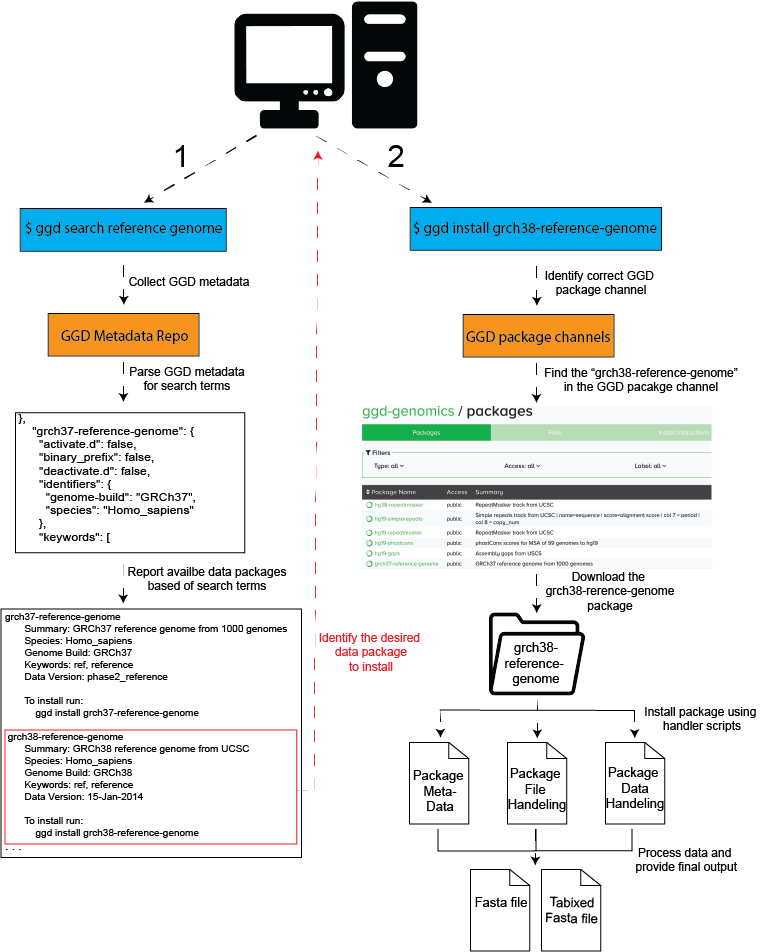

.. ggd documentation master file, created by
   sphinx-quickstart on Wed Dec 19 10:28:31 2018.
   You can adapt this file completely to your liking, but it should at least
   contain the root `toctree` directive.

.. image:: GoGetData.png

Welcome to the Go Get Data documentation!
=========================================

**ggd** is a data managment system that provides access to data package containing auto curated genomic data.
ggd hosts data packages that contain information on how to extract and process scientific data, providinig access
to a growing number of scientific datasets without the hassel of finding, downloading, and processing them
yourself. ggd leverages the `conda <http://conda.pydata.org/docs/intro.html>`_ package managment system 
and the infastructure of `Bioconda <https://bioconda.github.io/index.html>`_ to provide a stable source
of dataset and annotation repdroducibility. Using the ggd data managment system allows any user to quickly
access a desired dataset(s), and provides a stable way to cite data acess and use by refering to the ggd 
data package name and version. 

ggd consist of:

- a `repository of recipes <https://github.com/gogetdata/ggd-recipes>`_ hosted on Github
- a `comand line interface (cli) <https://github.com/gogetdata/ggd-cli>`_ to communicate with the ggd system
- a continually growing list of genomic recipes to provide easy and quick access to processed genomic data
  using the ggd cli tool

Quick Start
-----------
Use :code:`ggd` to search, find, and install a data package hosted by ggd. The data package will be installed and processed
on your system, and give you ready-to-use data files. For additional information see :ref:`Using GGD<using-ggd>`. 

Example:
++++++++

1. Lets say you you need to align some sequence(s) to the human reference genome for an analysis you are doing. 
   You will need download the reference genome from one of the sites that hosts it. You will need make sure it is 
   the correct genome build, it is the right reference genome, and download it from the site. You will then need 
   to sort and index the reference genome before you can use it. GGD simplifies this process by allowing you to search
   and install avaible processed genomic data packages using the ggd tool. 

.. code-block:: bash

    #******************************
    #1. Search for a reference genome
    #   (See ggd search)
    #******************************

    $ ggd search -t reference genome

      grch37-reference-genome
       Summary: GRCh37 reference genome from 1000 genomes
       Species: Homo_sapiens
       Genome Build: GRCh37
       Keywords: ref, reference
       Data Version: phase2_reference

       To install run:
           ggd install grch37-reference-genome
    
      grch38-reference-genome
       Summary: GRCh37 reference genome from UCSC
       Species: Homo_sapiens
       Genome Build: GRCh38
       Keywords: ref, reference
       Data Version: 15_Jan-2014

       To install run:
           ggd install grch38-reference-genome
    
      . . . 

    #******************************
    #2. Install the grch38 reference genome
    #   (See ggd install)
    #******************************

    $ ggd install grch38-reference-genome

      Looking for grch38-reference-genome in the 'ggd-genomics' channel
    
      grch38-reference-genome exists in ggd-genomics
    
      grch38-reference-genome is not installed on your system
    
      grch38-reference-genome has not been installed by conda
    
      Installing grch38-reference-genome
      Solving environment:
     
       ## Package Plan ##
    
       environment location: <conda root>
    
         added / updated specs: 
            - grch38-reference-genome
    
    
      The following packages will be downloaded:
    
         package                    |            build
        ---------------------------|-----------------
         grch38-reference-genome    |                0           6 KB  ggd-genomics
     
      The following NEW packages will be INSTALLED:
    
         grch38-reference-genome: 1-0 ggd-genomics
    
    
      Downloading and Extracting Packages
      grch38-reference-genome          | 6 KB      | ###########################################################################################
      Preparing transaction: done
      Verifying transaction: done
      Executing transaction: done
     
      DONE

    #******************************
    #3. Identify the data enviroment variable or the file location 
    #   (See ggd show-env or ggd list-files)
    #******************************

    $ ggd show-env

        ***************************
        Active environment variables:
        > $ggd_grch38_reference_genome
        ***************************

    $ ggd list-files grch38-reference-genome

      <conda root>/ share/ggd/Homo_sapiens/GRCh38/grch38-reference-genome/1/grch38.fa
      <conda root>/share/ggd/Homo_sapiens/GRCh38/grch38-reference-genome/1/grch38.fa.fai

    #******************************
    #4. Use files  
    #******************************

.. When using ggd please **cite our article** `author list <>`_.

Available Data Packages
-----------------------
You can see and search for available packages using the :ref:`Avaiable packages <recipes>` page of the 
ggd documentation

If you have the ggd cli tool installed, you can use :code:`ggd search` to search for available pacakges

.. _using-ggd:

Using GGD
=========

1. Install conda 
----------------
Go Get Data (GGD) requires the conda package managment system be installed on your system. Loading conda from a module 
is not sufficient. Please install Anaconda or Miniconda onto your system. The best way to
install it is with the `Miniconda <http://conda.pydata.org/miniconda.html>`_
package. The Python 3 version is recommended

2. Configure the conda channels
--------------------------------
Go Get Data (GGD) data packages are stored in the Anaconda cloud. Additionaly, ggd uses software tools available from 
other software pacakges in conda. A GGD conda channel, and other required channels, need to be added to your conda
configurations. You can add as many GGD channels as you would like, as they are available, but only one of the available
ggd channels is required. As GGD becomes more widely used additional channels will be created to support different areas of 
research

Available ggd channels:

- ggd-genomics

Run the following commands, adding in additional ggd channels as desired:

.. code-block:: bash 

    $ conda config --add channels defaults
    $ conda config --add channels ggd-genomics
    $ conda config --add channels bioconda
    $ conda config --add channels conda-forge

3. Install ggd
--------------
Go Get Data (GGD) needs to be installed on your system before you can use it. Run the following commands to download the 
ggd cli:

.. code-block:: bash

    $ conda install -y --file https://raw.githubusercontent.com/gogetdata/ggd-cli/master/requirements.txt
    $ pip install -U git+git://github.com/gogetdata/ggd-cli 

4. GGD tools
------------
The Go Get Data (GGD) command line tool (cli) installed in step 3 has built-in tools for accessing and managing 
data packages. These tools include:

- :ref:`ggd search <ggd-search>` Search for a ggd data package
- :ref:`ggd install <ggd-install>` Install a ggd data package
- :ref:`ggd uninstall <ggd-uninstall>` Uninstall a ggd data package
- :ref:`ggd list-files <ggd-list-files>` List the files for an installed ggd package
- :ref:`ggd pkg-info <ggd-pkg-info>` Show a specific ggd package's info
- :ref:`ggd show-env <ggd-show-env>` Show the ggd specific enviroment variables
- :ref:`ggd from-bash <ggd-from-bash>` Create a ggd recipe from a bash script
- :ref:`ggd check-recipe <ggd-check-recipe>` Check/test a ggd recipe

5. Contributing to GGD
----------------------
We intend for Go Get Data (GGD) to become a widely used data managment system for genomics and other reserach areas.
GGD provides support for reproducibility through Conda's naming, version tracking, and dependency handling structure.
One major function of the ggd cli tools is to provide an easy way to add data pacakges to the data repository. 

We welcome and encourage everyone to contribute to the data repository hosted by ggd.

Instructions on how to create a data pacakge and add it to ggd can be found on the :ref:`Contribute <make-data-packages>` 
documentation pages

Contents: 

.. toctree::
   :maxdepth: 2

   recipes
   ggd-search
   install
   uninstall
   list-file
   pkg-info
   show-env
   from-bash
   check-recipe
   contribute

