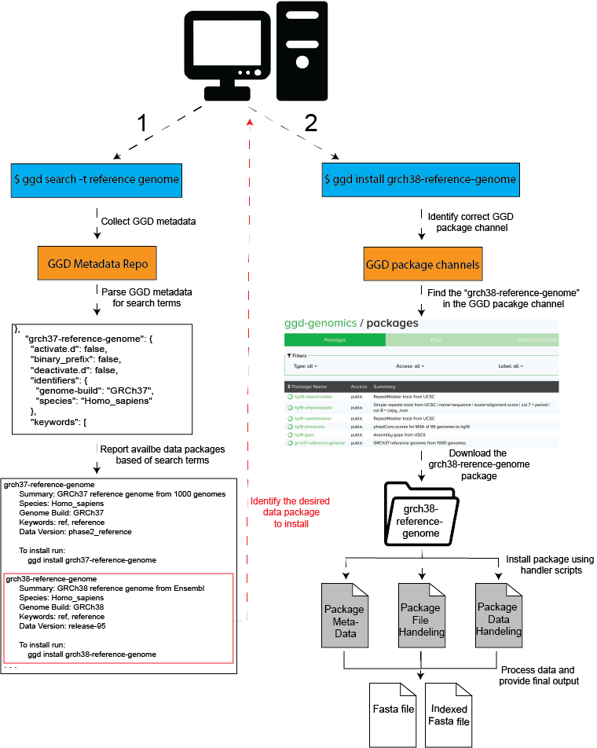

.. ggd documentation master file, created by
   sphinx-quickstart on Wed Dec 19 10:28:31 2018.
   You can adapt this file completely to your liking, but it should at least
   contain the root `toctree` directive.

.. _home-page:

.. image:: GoGetData.png

**For a quick guide to start using ggd see:** :ref:`GGD Quick Start <quick-start>`

Go Get Data (ggd) is a data management system that provides access to data package containing auto curated genomic data.
ggd hosts data packages that contain information on how to extract and process scientific data, providing access
to a growing number of scientific datasets without the hassle of finding, downloading, and processing them
yourself. ggd leverages the `conda <http://conda.pydata.org/docs/intro.html>`_ package management system
and the infrastructure of `Bioconda <https://bioconda.github.io/index.html>`_ to provide a fast and easy way 
retreive processed annotations and datasets, and provides a stable source of reproducibility. Using the ggd data management 
system allows any user to quickly access a desired dataset(s), and provides a platform upon which to cite data access 
and use by way of the ggd data package name and version.

.. image:: GGD-framework.png

ggd consists of:
++++++++++++++++

- a `repository of data recipes <https://github.com/gogetdata/ggd-recipes>`_ hosted on Github
- a `command line interface (cli) <https://github.com/gogetdata/ggd-cli>`_ to communicate with the ggd system
- a continually growing list of genomic recipes to provide quick and easy access to processed genomic data
  using the ggd cli tool

Capabilities
++++++++++++

See :ref:`GGD Quick Start <quick-start>` to start using ggd with minimal information. 

Use :code:`ggd` to search, find, and install a data package hosted by ggd. The data package will be installed and processed
on your system, and give you ready-to-use data files. For additional information see :ref:`Using GGD<using-ggd>`.

========

Example:
++++++++

1. Lets say you you need to align some sequence(s) to the human reference genome for an analysis you are doing. 
   You will need download the reference genome from one of the sites that hosts it. You will need make sure it is 
   the correct genome build, it is the right reference genome, and download it from the site. You will then need 
   to sort and index the reference genome before you can use it. GGD simplifies this process by allowing you to search
   and install avaible processed genomic data packages using the ggd tool. 

.. code-block:: bash

    #******************************
    #1. Search for a reference genome
    #   (See ggd search)
    #******************************

    $ ggd search -t reference genome

     grch37-reference-genome-1000g-v1
        Summary: GRCh37 reference genome from 1000 genomes
        Species: Homo_sapiens
        Genome Build: GRCh37
        Keywords: ref, reference, fasta-file
        Data Version: phase2_reference

        To install run:
            ggd install grch37-reference-genome-1000g-v1

     grch37-reference-genome-ensembl-v1
        Summary: The GRCh37 reference genome from Ensembl. Release 75. Primary Assembly file
        Species: Homo_sapiens
        Genome Build: GRCh37
        Keywords: ref, reference, Ensembl, Release75
        Data Version: Release-75

        To install run:
            ggd install grch37-reference-genome-ensembl-v1

     grch38-reference-genome-ensembl-v1
        Summary: The GRCh38 reference genome from Ensembl. Release 95. Primary Assembly file
        Species: Homo_sapiens
        Genome Build: GRCh38
        Keywords: ref, reference, genome, Ensembl
        Data Version: Release-95

        To install run:
            ggd install grch38-reference-genome-ensembl-v1
    
      . . . 

    #******************************
    #2. Install the grch38 reference genome
    #   (See ggd install)
    #******************************

    $ ggd install grch38-reference-genome-ensembl-v1

      Looking for grch38-reference-genome-ensembl-v1 in the 'ggd-genomics' channel
    
      grch38-reference-genome-ensembl-v1 exists in ggd-genomics
    
      grch38-reference-genome-ensembl-v1 is not installed on your system
    
      grch38-reference-genome-ensembl-v1 has not been installed by conda
    
      Installing grch38-reference-genome-ensembl-v1
      Solving environment:
     
       ## Package Plan ##
    
       environment location: <conda root>
    
         added / updated specs: 
            - grch38-reference-genome-ensembl-v1
    
    
      The following packages will be downloaded:
    
         package                            |            build
        ------------------------------------|-----------------
         grch38-reference-genome-ensembl-v1 |                0           6 KB  ggd-genomics
     
      The following NEW packages will be INSTALLED:
    
         grch38-reference-genome-ensembl: 1-0 ggd-genomics
    
    
      Downloading and Extracting Packages
      grch38-reference-genome-ensembl-v1       | 6 KB      | ###########################################################################################
      Preparing transaction: done
      Verifying transaction: done
      Executing transaction: done
     
      DONE

    #******************************
    #3. Identify the data enviroment variable or the file location 
    #   (See ggd show-env or ggd list-files)
    #******************************

    $ ggd show-env

        ***************************
        Active environment variables:
        > $ggd_grch38_reference_genome-ensembl_v1_dir
        > $ggd_grch38_reference_genome-ensembl_v1_file
        ***************************

    $ ggd list-files grch38-reference-genome-ensembl-v1

      <conda root>/ share/ggd/Homo_sapiens/GRCh38/grch38-reference-genome-ensembl-ensembl-v1/1/grch38.fa
      <conda root>/share/ggd/Homo_sapiens/GRCh38/grch38-reference-genome-ensembl-ensembl-v1/1/grch38.fa.fai

    #******************************
    #4. Use files  
    #    To use the downloaded data packages you can use the full file path from running `ggd list-files` 
    #    or the environment variables created during installation
    #   For more info see the `Using installed data` tab.
    #******************************

.. When using ggd please **cite our article** `author list <>`_.

Available Data Packages
-----------------------
You can see and search for available packages using the :ref:`Available packages <recipes>` page of the
ggd documentation

If you have the ggd cli tool installed, you can use :code:`ggd search` to search for available packages.

Contents:

.. toctree::
   :maxdepth: 2

   quick-start
   using-ggd
   ggd-search
   install
   uninstall
   list-file
   pkg-info
   show-env
   make-recipe
   check-recipe
   contribute
   recipes

